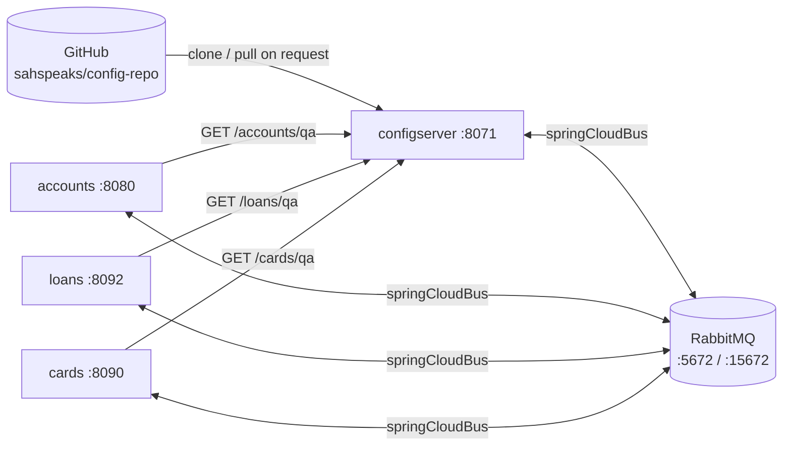

# Bank Microservices with Spring Cloud Config

Three Spring Boot microservices (**accounts**, **loans**, **cards**) that get their configuration from a central **Spring Cloud Config Server**. The config server reads from a GitHub repo. Changes are pushed out to the running services over **Spring Cloud Bus (RabbitMQ)**. Every service is packaged into a container image with **Jib**, published to **Docker Hub**, and run together with **Docker Compose**.

| | |
|---|---|
| Java | 21 |
| Spring Boot | 4.1.1 |
| Spring Cloud | 2025.1.3 |
| Image build | Jib Maven plugin 3.5.2 |
| Registry | Docker Hub, `docker.io/sahspeaks/*` |
| Config source | https://github.com/sahspeaks/config-repo (branch `main`) |
| Message broker | RabbitMQ 3 (management image) |
| Database | H2 in-memory, one per service |

---

## 1. Architecture



### Startup sequence

1. **RabbitMQ** starts. Compose waits for its healthcheck (`rabbitmq-diagnostics ping`).
2. **configserver** starts, clones `config-repo` (`clone-on-start: true`) and connects to RabbitMQ. Compose waits for `/actuator/health/readiness` to report `UP`.
3. **accounts, loans and cards** start. Each one:
   - reads `spring.config.import=configserver:http://configserver:8071`;
   - calls `GET http://configserver:8071/{spring.application.name}/{spring.profiles.active}`, for example `/accounts/qa`;
   - merges the returned property sources: `accounts-qa.yml` overrides `accounts.yml`, which overrides the local `application.yml`.

   The import is **not** `optional:`, so a service **fails fast** and exits if the config server can't be reached. That's why the Compose file uses healthcheck-based `depends_on`.

### How a config fetch resolves

The config server maps `/{application}/{profile}` to files in the Git repo:

| Request | Files returned (highest priority first) |
|---|---|
| `/accounts/default` | `accounts.yml` |
| `/accounts/qa` | `accounts-qa.yml`, `accounts.yml` |
| `/accounts/prod` | `accounts-prod.yml`, `accounts.yml` |

Try it:

```bash
curl -s localhost:8071/accounts/qa | jq
curl -s localhost:8071/loans/prod | jq
```

Each file sets `build.version` (1.0.0 default, 2.0.0 qa, 3.0.0 prod) and a `<service>.message / contactInfo / onboarding` block. The block binds to `AccountContactInfo`, `LoansContactInfo` and `CardsContactInfo` through `@ConfigurationProperties`.

> `configserver/src/main/resources/config-repo/` is a **local copy** of the Git repo. The config server only uses it when started with the `native` profile. That block is commented out in `configserver/src/main/resources/application.yml`. With `SPRING_PROFILES_ACTIVE=git` the local folder is ignored, so **edit and push the GitHub repo** instead.

---

## 2. Repository layout

```
.
├── configserver/            Spring Cloud Config Server (+ Bus, + Monitor)
├── accounts/                Accounts & customer CRUD
├── loans/                   Loans CRUD
├── cards/                   Cards CRUD
├── build-run.sh             build all images with Jib + start the stack (see §5)
└── docker-compose/
    ├── default/docker-compose.yml   the full stack (services run with profile "qa")
    ├── qa/                          empty, reserved
    └── prod/                        empty, reserved
```

Each business service follows the same layered structure under `com.learnspring`:

```
controller/  REST endpoints + OpenAPI annotations
service/     I*Service interface + *ServiceImpl
repository/  Spring Data JPA repositories
entity/      JPA entities; BaseEntity has audit columns (created_at/by, updated_at/by)
dto/         request/response DTOs with Bean Validation
mapper/      entity <-> DTO mapping
exception/   custom exceptions + @ControllerAdvice GlobalExceptionHandler
audit/       AuditAwareImpl, supplies the "created_by" value for JPA auditing
config/      *ContactInfo, @ConfigurationProperties bound from the config server
constant/    status codes / messages
```

Tables are created from each service's `src/main/resources/schema.sql` into an in-memory H2 database, so **all data is lost on restart**.

---

## 3. Services, ports and endpoints

| Service | Container port | Host port | Swagger UI | H2 console |
|---|---|---|---|---|
| configserver | 8071 | 8071 | – | – |
| accounts | 8080 | 8080 | http://localhost:8080/swagger-ui.html | http://localhost:8080/h2-console |
| loans | 8092 | 8092 | http://localhost:8092/swagger-ui.html | http://localhost:8092/h2-console |
| cards | 8090 | 8090 | http://localhost:8090/swagger-ui.html | http://localhost:8090/h2-console |
| rabbitmq | 5672 (AMQP), 15672 (UI) | same | http://localhost:15672 (guest/guest) | – |

H2 JDBC URL: `jdbc:h2:mem:testdb`, user `sa`, empty password.

### accounts: `/api/accounts`

| Method | Path | Notes |
|---|---|---|
| POST | `/create` | Body: `{ "name", "email", "mobileNumber" }` |
| GET | `/getCustomerDetails/{mobileNumber}` | 10-digit mobile number |
| PUT | `/update` | Body: `CustomerDto` including `accountsDto` |
| DELETE | `/delete/{mobileNumber}` | |
| GET | `/java-version` | Returns `JAVA_HOME` and `build.version` from the config server |
| GET | `/contact-info` | Returns the `accounts.*` block from the config server |

### loans: `/api/loans`

| Method | Path | Notes |
|---|---|---|
| POST | `/create?mobileNumber=` | |
| GET | `/fetch?mobileNumber=` | |
| PUT | `/update` | Body: `LoansDto` |
| DELETE | `/delete?mobileNumber=` | |

### cards: `/api/cards`

| Method | Path | Notes |
|---|---|---|
| POST | `/create?mobileNumber=` | |
| GET | `/fetch?mobileNumber=` | |
| PUT | `/update` | Body: `CardsDto` |
| DELETE | `/delete?mobileNumber=` | |

Quick smoke test:

```bash
curl -s -X POST localhost:8080/api/accounts/create \
  -H 'Content-Type: application/json' \
  -d '{"name":"Abhishek","email":"abhi@example.com","mobileNumber":"9876543210"}'
curl -s localhost:8080/api/accounts/getCustomerDetails/9876543210
curl -s localhost:8080/api/accounts/contact-info      # should say "... QA"
curl -s -X POST "localhost:8092/api/loans/create?mobileNumber=9876543210"
curl -s -X POST "localhost:8090/api/cards/create?mobileNumber=9876543210"
```

---

## 4. Environment variables

The `application.yml` files contain `${...}` placeholders with **no defaults**. Every variable below must be set, both in Docker and when running from an IDE.

| Variable | Used by | Compose value | Purpose |
|---|---|---|---|
| `SPRING_PROFILES_ACTIVE` | configserver | `git` | Enables the Git backend. Use `native` for the local folder. |
| `SPRING_PROFILES_ACTIVE` | accounts / loans / cards | `qa` | Selects `<app>-qa.yml` from the config repo |
| `SPRING_CONFIG_IMPORT` | accounts / loans / cards | `configserver:http://configserver:8071` | Config server location. The host name is the Compose service name. |
| `SPRING_APPLICATION_NAME` | accounts / loans / cards | service name | Must match the file prefix in the config repo |
| `SPRING_RABBITMQ_HOST` | all four | `rabbitmq` | |
| `SPRING_RABBITMQ_PORT` | all four | `5672` | |
| `SPRING_RABBITMQ_USERNAME` | all four | `guest` | |
| `SPRING_RABBITMQ_PASSWORD` | all four | `guest` | |
| `ENCRYPT_KEY` | configserver | `mysecretkey` | Symmetric key for the `/encrypt` and `/decrypt` endpoints and `{cipher}` values |

To switch the whole stack to prod config, set `SPRING_PROFILES_ACTIVE: prod` on the three services. `/api/accounts/contact-info` will then say "PROD" and `build.version` becomes `3.0.0`.

---

## 5. Setup

### Prerequisites

- JDK 21
- Maven 3.9+ (no Maven wrapper is committed, so use a system `mvn`)
- Docker Desktop, with Compose v2
- A Docker Hub account, only needed to **push** images

### Option A: build and run everything with `build-run.sh`

`build-run.sh` in the repo root does the whole flow in one command:

1. Builds and **pushes** all four images to Docker Hub with `mvn compile jib:build`, in the order `configserver` → `accounts` → `loans` → `cards`.
2. Starts the stack with `docker compose -f docker-compose/<env>/docker-compose.yml up -d --remove-orphans`.
3. Prints `docker compose ps` and the command for following the logs.

```bash
chmod +x build-run.sh                 # once, otherwise: "zsh: permission denied"
docker login                          # once, because the script pushes to Docker Hub

./build-run.sh                        # build + push + run, using docker-compose/default
./build-run.sh default --no-build     # skip the Maven/Jib step, just (re)start the stack
./build-run.sh qa                     # use docker-compose/qa/docker-compose.yml
./build-run.sh prod                   # use docker-compose/prod/docker-compose.yml
```

| Argument | Values | Default | Effect |
|---|---|---|---|
| 1st | `default`, `qa`, `prod` | `default` | Picks the Compose file `docker-compose/<env>/docker-compose.yml`. Any other value exits with a usage message. |
| 2nd | `--no-build` | build | Skips the image build and only runs Compose |

Behaviour to know:

- **Stops on the first error** (`set -euo pipefail`). If one service's build fails, the later services aren't built and the stack isn't started.
- **`qa` and `prod` don't work yet.** Those folders are still empty, so the script exits with `Docker Compose file not found`. Add a `docker-compose.yml` to them first.
- **`--remove-orphans`** deletes containers from earlier runs whose service is no longer in the Compose file.
- **The Compose environment doesn't change the Spring profile.** The profile comes from `SPRING_PROFILES_ACTIVE` inside the chosen Compose file (`qa` in `default/docker-compose.yml`).
- **Compose may start the old images.** `jib:build` pushes the new images to Docker Hub, but `docker compose up` keeps using a local `sahspeaks/*:latest` image if one exists and doesn't pull the new one. To be sure you run what you just built, do one of these:
  - run `docker compose -f docker-compose/default/docker-compose.yml pull` before `up`;
  - add `--pull always` to the `up` command in the script;
  - switch the script to `mvn compile jib:dockerBuild`, which builds straight into local Docker, skips the Docker Hub upload and doesn't need `docker login`.
- **Warnings during the Jib step are normal.** Lines like `The base image requires auth`, `credential helper ... has nothing for server URL` and `'mainClass' ... ${start-class}` don't mean anything failed. The build only failed if you see `[ERROR]` / `BUILD FAILURE`.

### Option B: run the published images without building

```bash
cd docker-compose/default
docker compose up -d
docker compose ps          # configserver should show "(healthy)"
docker compose logs -f accounts
```

Stop and remove everything:

```bash
docker compose down
```

### Option C: run from source / IDE

1. Start RabbitMQ only:
   ```bash
   docker run -d --name rabbitmq -p 5672:5672 -p 15672:15672 rabbitmq:3-management
   ```
2. Start **configserver** with:
   ```
   SPRING_PROFILES_ACTIVE=git
   SPRING_RABBITMQ_HOST=localhost SPRING_RABBITMQ_PORT=5672
   SPRING_RABBITMQ_USERNAME=guest SPRING_RABBITMQ_PASSWORD=guest
   ENCRYPT_KEY=mysecretkey
   ```
   ```bash
   cd configserver && mvn spring-boot:run
   ```
3. Wait for `Started ConfigserverApplication`, then start each service with:
   ```
   SPRING_PROFILES_ACTIVE=qa
   SPRING_CONFIG_IMPORT=configserver:http://localhost:8071
   SPRING_RABBITMQ_HOST=localhost SPRING_RABBITMQ_PORT=5672
   SPRING_RABBITMQ_USERNAME=guest SPRING_RABBITMQ_PASSWORD=guest
   ```
   ```bash
   cd accounts && mvn spring-boot:run
   ```
   Do the same for `loans` and `cards`.

   From the host the config server is at `localhost`. `configserver` is a host name that only resolves inside the Compose network.

---

## 6. Building images with Jib and publishing to Docker Hub

Each `pom.xml` configures Jib like this:

```xml
<plugin>
  <groupId>com.google.cloud.tools</groupId>
  <artifactId>jib-maven-plugin</artifactId>
  <version>3.5.2</version>
  <configuration>
    <to>
      <image>docker.io/sahspeaks/${project.artifactId}:latest</image>
    </to>
  </configuration>
</plugin>
```

`${project.artifactId}` resolves to `configserver`, `accounts`, `loans` or `cards`. That gives four images:
`sahspeaks/configserver:latest`, `sahspeaks/accounts:latest`, `sahspeaks/loans:latest` and `sahspeaks/cards:latest`.

### What `mvn compile jib:build` does

```bash
cd accounts
mvn compile jib:build
```

1. **`compile`**: Maven compiles `src/main/java` into `target/classes`, and Lombok runs as an annotation processor. Jib needs compiled classes, but not a fat JAR, so `package` isn't required.
2. **`jib:build`**:
   - Pulls the **base image** metadata. None is configured, so Jib 3.5 picks **`eclipse-temurin:21-jre`** to match `java.version=21`. It's Ubuntu-based, which is why `curl` is available for the healthcheck.
   - Builds layers **without a Dockerfile and without the Docker daemon**:
     - dependencies (rarely change)
     - snapshot dependencies
     - resources (`application.yml`, `schema.sql`)
     - classes (your code, which changes most often)

     When you only change code, only the small classes layer is re-uploaded.
   - Sets the entrypoint to `java -cp @/app/jib-classpath-file com.learnspring.AccountsApplication`.
   - **Pushes straight to Docker Hub** (`docker.io/sahspeaks/accounts:latest`) over the registry HTTP API.
3. Docker Compose later pulls that tag from Docker Hub when you run `docker compose up` or `docker compose pull`.

```
source ──mvn compile──▶ target/classes ──jib:build──▶ Docker Hub (sahspeaks/accounts:latest)
                                                              │
                                              docker compose pull / up
                                                              ▼
                                                     local container
```

### Authentication to Docker Hub

Jib reads the same credentials Docker uses:

```bash
docker login            # stores creds in the macOS keychain (credsStore: desktop)
mvn compile jib:build   # Jib picks them up automatically
```

In CI, or without `docker login`:

```bash
mvn compile jib:build \
  -Djib.to.auth.username=sahspeaks \
  -Djib.to.auth.password=$DOCKERHUB_TOKEN     # use a Docker Hub access token, not your password
```

### Build all four images

Use `./build-run.sh` (see [section 5](#option-a-build-and-run-everything-with-build-runsh)), which builds and pushes all four and then starts the stack. To build only, without starting anything:

```bash
for s in configserver accounts loans cards; do (cd $s && mvn -q compile jib:build) || break; done
```

### Other Jib goals

| Command | Result |
|---|---|
| `mvn compile jib:build` | Build and push to the registry. No Docker daemon needed. |
| `mvn compile jib:dockerBuild` | Build into the **local** Docker daemon only, with no push. Good for testing. |
| `mvn compile jib:buildTar` | Write `target/jib-image.tar` (`docker load < target/jib-image.tar`) |

### Things to know

- **"Created 56 years ago"**: Jib sets the image timestamp to the Unix epoch so builds are reproducible. This is expected.
- **Architecture**: images are currently built for **linux/amd64** only. On an Apple Silicon Mac they run under emulation, which is why the config server takes about 20 seconds to boot. See [Future implementations](#9-future-implementations).
- **The `latest` tag is overwritten on every push**, so there is no way to roll back. Prefer versioned tags (see below).
- The accounts `pom.xml` also has a commented-out **Buildpacks** config (`spring-boot:build-image`). That's an alternative to Jib and isn't currently used.

---

## 7. Docker Compose (`docker-compose/default/docker-compose.yml`)

All five containers join the user-defined bridge network `microservices-network`, so they can reach each other by **service name** (`configserver`, `rabbitmq`).

Startup ordering uses healthchecks, not just container start:

```yaml
configserver:
  depends_on:
    rabbitmq:
      condition: service_healthy
  healthcheck:
    test: ["CMD-SHELL", "curl -fs http://localhost:8071/actuator/health/readiness | grep UP || exit 1"]
    interval: 10s
    timeout: 5s
    retries: 10
    start_period: 20s

accounts:   # same for loans and cards
  depends_on:
    configserver:
      condition: service_healthy
```

> A plain `depends_on: [configserver]` only waits for the container to *start*. The services then call the config server before its Tomcat is listening, get `Connection refused`, and exit with `ConfigClientFailFastException`. The healthcheck prevents this.

Useful commands:

```bash
docker compose pull                    # fetch newest images from Docker Hub
docker compose up -d                   # start (recreates containers whose image changed)
docker compose ps                      # status + health
docker compose logs -f configserver
docker compose restart accounts
docker compose down                    # stop + remove containers and network
```

---

## 8. Refreshing config without restarting

Every service includes `spring-cloud-starter-bus-amqp` and exposes `refresh` and `busrefresh`. The config server also includes `spring-cloud-config-monitor`.

**Manual:**

1. Edit a file in https://github.com/sahspeaks/config-repo and push.
2. Trigger a refresh:
   ```bash
   curl -X POST localhost:8080/actuator/busrefresh     # refreshes ALL services through RabbitMQ
   # or, for a single instance only:
   curl -X POST localhost:8080/actuator/refresh
   ```
3. `curl localhost:8080/api/accounts/contact-info` now shows the new values. `@ConfigurationProperties` beans are re-bound. `@Value` fields such as `build.version` are **not** updated unless the bean is `@RefreshScope`.

**Automatic (GitHub webhook):**

1. Add a GitHub webhook on `config-repo` that POSTs to `https://<public-url>/monitor` with content type `application/json`.
2. GitHub can't reach `localhost`, so expose port 8071 through a tunnel such as ngrok, Cloudflare Tunnel or hookdeck.
3. On a push, the config server's `/monitor` publishes a refresh event on the bus. Every service reloads.

**Encrypting secrets in the config repo:**

```bash
curl -s localhost:8071/encrypt -d 'my-db-password'     # → 3f9a...
# in config-repo/accounts-prod.yml:
#   db.password: '{cipher}3f9a...'
```

The config server decrypts `{cipher}` values with `ENCRYPT_KEY` before serving them.

---

## 9. Future implementations

**Build and release**
- [ ] Add a parent/aggregator `pom.xml` so `mvn -pl accounts,loans,cards,configserver compile jib:build` builds everything at once. Add the Maven wrapper (`mvnw`).
- [ ] Tag images with the project version as well as `latest`, e.g. `<tags><tag>${project.version}</tag></tags>`. Set `version: 1.0.0` instead of `0.0.1-SNAPSHOT`.
- [ ] Build multi-arch images (`<from><platforms>` with `linux/amd64` and `linux/arm64`) so Apple Silicon machines run them natively.
- [ ] Add a GitHub Actions pipeline: test → `jib:build` with Docker Hub token secrets → optional deploy.

**Configuration and security**
- [ ] Fill in `docker-compose/qa` and `docker-compose/prod` with their own Compose files (profile `qa` / `prod`), or use one file plus `.env` files.
- [ ] Move `ENCRYPT_KEY` and the RabbitMQ credentials out of the Compose file into an `.env` file (git-ignored) or Docker secrets.
- [ ] Reduce the config server's actuator exposure from `"*"` to only what's needed (`health, info, busrefresh, monitor`).
- [ ] Protect the config server with Spring Security (basic auth), and use a GitHub token or deploy key if `config-repo` becomes private.
- [ ] Add `spring.cloud.config.retry` (+ `spring-retry`) on clients for extra startup resilience.

**Data**
- [ ] Replace H2 with MySQL or PostgreSQL containers so data survives restarts. Use per-service databases and healthchecks.

**Microservice patterns (next steps of the course)**
- [ ] **Service discovery**: Eureka server; services register instead of using hard-coded host names.
- [ ] **API gateway**: Spring Cloud Gateway as the single entry point (routing, auth, rate limiting).
- [ ] **Inter-service calls**: an accounts "customer details" endpoint that aggregates loans and cards through OpenFeign.
- [ ] **Resilience**: Resilience4j circuit breaker, retry and timeouts around those calls.
- [ ] **Observability**: Micrometer + Prometheus + Grafana for metrics, Loki for logs, Tempo/OpenTelemetry for traces.
- [ ] **Security**: OAuth2 / Keycloak at the gateway.
- [ ] **Event-driven**: Spring Cloud Stream on RabbitMQ or Kafka for async notifications.
- [ ] **Deployment**: Kubernetes manifests / Helm charts, with liveness and readiness probes on the existing `/actuator/health/*` groups.

---

## 10. Troubleshooting

| Symptom | Cause | Fix |
|---|---|---|
| `ConfigClientFailFastException ... Connection refused` for `http://configserver:8071/...` | Service started before the config server was ready | Keep the healthcheck `depends_on`, then `docker compose up -d` again |
| Same error when running from the IDE | `SPRING_CONFIG_IMPORT` points to `configserver` | Use `configserver:http://localhost:8071` |
| `Could not resolve placeholder 'SPRING_RABBITMQ_HOST'` | Env vars not set | Set every variable in [section 4](#4-environment-variables) |
| `/contact-info` shows `DEFAULT` instead of `QA` | `SPRING_PROFILES_ACTIVE` not set on the service | Set it to `qa` / `prod` |
| Service reachable in the container but not from the host | Host:container port mismatch | Check the `ports:` mapping against `server.port` |
| `jib:build` → `401 Unauthorized` | Not logged in to Docker Hub | `docker login`, or pass `-Djib.to.auth.*` |
| Pushed a new image but Compose runs the old one | Local cache of `latest` | `docker compose pull && docker compose up -d` |
| `zsh: permission denied: ./build-run.sh` | Script isn't executable | `chmod +x build-run.sh` |
| `Docker Compose file not found: .../docker-compose/qa/docker-compose.yml` | `qa` / `prod` Compose files don't exist yet | Use `./build-run.sh default`, or create the file |
| `build-run.sh` finished but the containers run old code | Compose reused the local `latest` images instead of pulling the new ones | `docker compose -f docker-compose/default/docker-compose.yml pull`, then run with `--no-build` |
| Config change in GitHub not visible | No refresh was triggered | `POST /actuator/busrefresh` on any service |
